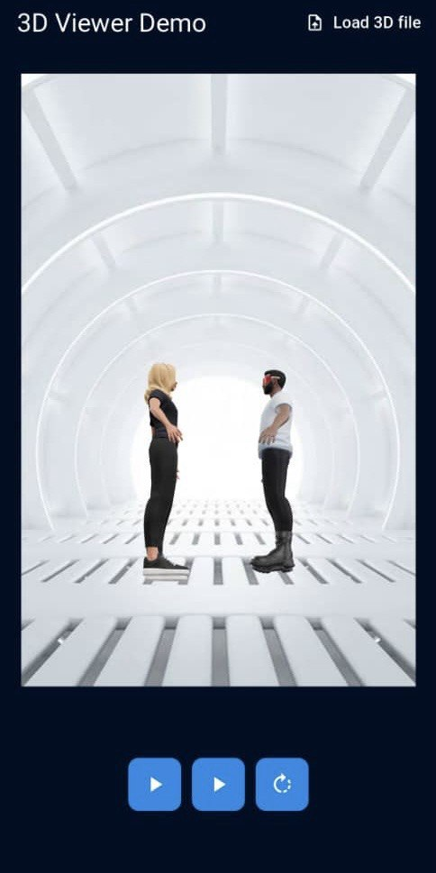

# 3D model viewer App

## Overview
3D model viewer App is a Flutter mobile application that loads 3d models in .glb formt and plays animations. The 3d model was gotten from  [Ready player me ](https://readyplayer.me/) and  animation from https://github.com/readyplayerme/animation-library


## mobile ui



## link to demo
[Appetize](https://appetize.io/app/b_cizp6qdx52f2wmmy4afsoolozy)
[Videodemo](https://drive.google.com/drive/folders/1s0z8TWk32WaQ7HVpxKhmI-zKXvAU02Gq?usp=sharing)


## dependencies used
- flutter_3d_controller
- file_picker

---

## Project Setup

### Prerequisites
Ensure you have the following installed:
- Flutter SDK (Latest Stable Version) → [Download Here](https://flutter.dev/docs/get-started/install)
- Dart
- Android Studio / VS Code (with Flutter plugin installed)
- A real or virtual mobile device

### Clone the Repository
```sh
 git clone the repository
 cd repo
```

### Install Dependencies
Run the following command to install the required dependencies:
```sh
flutter pub get
```

## Running the App
To launch the app on an emulator or real device, use:
```sh
flutter run
```
To run on iOS:
```sh
cd ios
pod install
cd ..
flutter run
```

---

## Contribution Guidelines
1. Fork the repository
2. Create a new branch (`git checkout -b feature-branch`)
3. Make changes and commit (`git commit -m "Added a new feature"`)
4. Push to the branch (`git push origin feature-branch`)
5. Open a Pull Request


